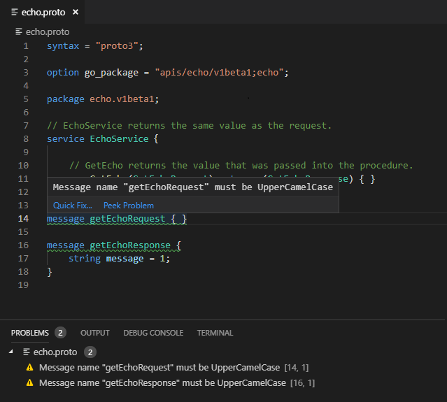

# vscode-protobuflinter [](https://github.com/jpreese/vscode-protobuflint/blob/master/LICENSE) [](https://github.com/jpreese/vscode-protobuflint/releases)

vscode-protobuflinter is a protocol buffer linter for [Visual Studio Code](https://code.visualstudio.com/) that uses [protolint](https://github.com/yoheimuta/protolint) to validate linting rules.

## Example

Using the following `.protolint.yaml` configuration file

```yaml
lint:
  rules:
    no_default: true

    add:
      - MESSAGE_NAMES_UPPER_CAMEL_CASE
```

Renders the following display within visual studio code



## Installation

A VSIX installer is available on the [releases](https://github.com/jpreese/vscode-protobuflint/releases) page

```
NOTE: protolint must be installed and available in your PATH
```

## Local Development

To compile the solution locally run `npm run compile`

To run the unit tests run `npm run test`

To run the extension in a Visual Studio Code development environment press `F5` in Visual Studio Code
