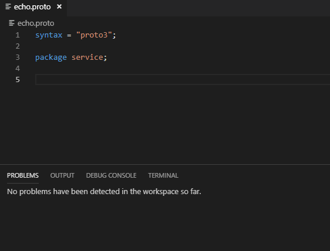

# vscode-protolint [](https://github.com/plexsystems/vscode-protolint/blob/master/LICENSE) [](https://github.com/plexsystems/vscode-protolint/releases)

vscode-protolint is a protocol buffer linter for [Visual Studio Code](https://code.visualstudio.com/) that uses [protolint](https://github.com/yoheimuta/protolint) to validate linting rules.

## Example

Using the following `.protolint.yaml` configuration file

```yaml
lint:
  rules:
    no_default: true

    add:
      - MESSAGE_NAMES_UPPER_CAMEL_CASE
      - SERVICE_NAMES_UPPER_CAMEL_CASE
```



## Installation

This extension can be installed through the Visual Studio [marketplace](https://marketplace.visualstudio.com/items?itemName=Plex.vscode-protolint). Alternatively, a VSIX installer is available on the [releases](https://github.com/plexsystems/vscode-protolint/releases) page.

```
NOTE: protolint must be installed and available in your PATH
```

## Local Development

Before running any of the below commands, make sure you have installed the required dependencies with `npm install`

- To compile the solution locally run `npm run compile`

- To run the unit tests run `npm run test`

- To run the extension in a Visual Studio Code development environment press `F5` in Visual Studio Code
